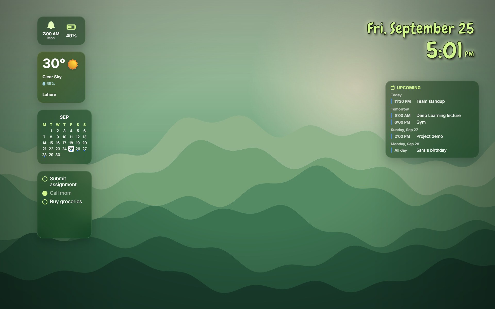

# Live Wallpaper Dashboard

Turn your Windows desktop into a live dashboard. Your wallpaper shows the time, weather, your calendar, alarms and reminders, right behind your desktop icons, on top of any picture you like.

**Website:** [live-wallpaper-dashboard.vercel.app](https://live-wallpaper-dashboard.vercel.app)

## Download

1. Go to the [Releases page](https://github.com/rabiya43/custom-wallpaper/releases/latest) and download **Live-Wallpaper-Dashboard-Setup-&lt;version&gt;.exe**.
2. Run it and follow the steps.
3. If Windows says **"Windows protected your PC"**, click **More info**, then **Run anyway**. This shows up because the app isn't signed with a paid certificate; it's safe.

Works on Windows 10 and 11 (64-bit). You only download it once: new versions install themselves.

## Getting started

When the app starts, your wallpaper becomes the dashboard and a small icon appears in the **system tray** (bottom-right corner, near the clock; click the **^** arrow if you don't see it). Right-click that icon for everything:

- **Customize wallpaper**: change the picture, move widgets, set alarms and connect your calendar. You can also double-click the tray icon.
- **Alarms** and **Calendars**: open those right over your desktop.
- **Pause live wallpaper**: go back to your normal Windows wallpaper for a while.
- **Clickable widgets on the desktop**: turn desktop clicks on the widgets on or off (see below).
- **Start with Windows**: open the app automatically when you sign in.
- **Quit**: close the app and bring back your normal wallpaper.

While customizing, everything is in the **Customize** panel at the bottom of the screen: wallpapers, **Alarms**, **Calendars**, and **Done** when you've finished.

The first time you customize, a short **tour** shows you around. Use **Next** and **Back**, or **Skip tour** if you'd rather explore on your own. To see it again, click the **?** next to **Done**.

## Clicking widgets on your desktop

The widgets work right on your desktop. Click an empty part of the desktop over a widget:

| Click | What happens |
|---|---|
| A reminder | Ticks it off (click again to untick) |
| The reminders box | Type a new reminder right there and press **Enter** |
| Alarm bell | Your alarms pop up, to add or change one |
| A date on the calendar | That day's events pop up, where you can add one |
| An event in **Upcoming** | The event pops up so you can change it |
| The circle next to an event | Marks it as done (click again to undo) |
| Weather | Opens the Windows Weather app |
| Battery | Opens Windows' Power & battery settings |

Only that one thing pops up over your desktop, not the whole app. When you're done, press **Esc**, click the **x**, or click anywhere else, and you're back on your desktop with the change already showing.

A widget lights up when your mouse is over it. A click takes a split second to act, because the app waits to see whether it's a double-click (see below). Your desktop keeps working as usual: clicking an icon only selects the icon, dragging still selects icons, right-click still shows the Windows menu, and nothing happens when a window is in front of the widget.

**Double-click** any widget to edit it right on the desktop: drag it to move it, drag its corner to resize it, **Original size** puts its size back, and **×** hides it. Press **Done** or **Esc** when you're finished; **Reset all** brings everything back to where it started.

The **date** and **time** also have a **Format** button while you edit them: pick 12- or 24-hour time (with or without seconds), how the date is written, and a font for each: Playful, Clean, Elegant, Modern, Digital or Script.

To change the picture and everything else, use **Customize wallpaper**.

## Choosing a wallpaper

In **Customize wallpaper**, use the **Customize** panel:

- **Search**: type a character, movie, show or place (for example *Elsa Frozen* or *Studio Ghibli*) and click a picture you like. Use **Load more** for more choices. Pictures marked **May look blurry** are small for your screen.
- **Search the whole web** (the globe button next to **Find**): opens Google, Bing or DuckDuckGo Images. **Click a picture to open it big first**, then right-click the big one and choose **Set as wallpaper**. The small previews in the results would look blurry, so the app asks for the big one.
- **Built-in wallpapers**: six ready-made designs that look sharp on any screen.
- **Upload**: use a picture from your computer, or drag one onto the screen.
- **Fill screen or Centered**: choose whether the picture fills the whole screen or sits in the middle at its natural shape.

The colors of the clock and widgets change to match your picture automatically.

To move or resize a widget, **double-click** it, drag it where you want, and resize it from the corner. **Original size** undoes a resize, and **×** hides the widget. Press **Esc** when you're done. **Reset layout** puts everything back.

## Alarms

Open **Alarms** (tray menu, the bell on your desktop, or the **Alarms** button in the Customize panel) and press **Add alarm**.

- **Type when it should ring**, the way you'd say it: *tomorrow 7am*, *fri 6:30pm*, *in 20 min*, *25/12 8pm*, *every weekday 7:30*, *mondays 8pm*. The app shows how it understood you and fills in the details.
- Or set the **time**, **date** and **repeat days** yourself, and add a **label** like *Class* or *Gym*.
- Pick a **sound**: one of the built-in tones, or **your own sound** (MP3, WAV and more). Press **Preview** to hear it.

When an alarm goes off, a window pops up on top of everything and the sound gently gets louder until you press **Snooze** (5 minutes) or **Dismiss**. The bell on your dashboard always shows your next alarm.

Alarms ring while the app is running, even if you're not customizing. Like most alarm apps, they can't wake a computer that's asleep or turned off.

## Your calendar

Open **Calendars** and press **Sign in with Google**. Google's sign-in page opens in your browser; sign in there and come back. The app never sees your password.

Once you're signed in:

- Your events appear on the dashboard: dots on the calendar and an **Upcoming** list.
- **Add an event**: click a date on the calendar, then **Add event**. Type when it happens, like *tomorrow 3-4:30pm* or *fri 10am*.
- **Change or delete an event**: click it in **Upcoming** or in a day's list.
- **Mark an event as done**: tick the circle next to it in **Upcoming**. Handy for assignments you've handed in. This is only remembered on your computer; it doesn't change anything in Google Calendar or Google Classroom.
- **Get reminded by email**: choose when (for example *30 minutes before*) and tick **Email me** and/or **Notify on my phone**. Google sends the reminder, so it arrives even when your computer is off.

Everything you change shows up in Google Calendar on your phone and other devices too.

**School accounts:** if you sign in with a school Google account, your class assignments and class events show in **Upcoming** too. They belong to your school, so you can view them and tick them off, but not edit them.

**Other calendars** (like a university timetable or Outlook) can be shown too, read-only: open **Other calendars** in the Calendars panel and paste the calendar's private iCal link. The panel explains where to find it.

## Weather and battery

- **Weather** uses your location to show the current temperature and conditions. For your exact area, turn on **Location** in Windows (Settings → Privacy & security → Location, including *Let desktop apps access your location*); otherwise the app estimates your city from your internet connection. Click the weather to open the Windows Weather app. While customizing, the pin next to it opens the Location setting.
- **Battery** shows your charge, a lightning bolt while charging, and the time left when you hover over it while customizing. Click it to open Windows' Power & battery settings.

## Updates

The app updates itself. When a new version is ready, a small card appears in the bottom-right corner showing what's new:

- **Update now** installs it and reopens the app within a few seconds.
- **Later** installs it the next time the app closes.

Your wallpaper, alarms, layout and calendar sign-in are kept. You can also check yourself: right-click the tray icon and choose **Check for updates**.

Versions before 1.2.0 can't update themselves, so if you have one of those, download the latest version once from the [Releases page](https://github.com/rabiya43/custom-wallpaper/releases/latest).

## Privacy

- Full details: [Privacy Policy](https://live-wallpaper-dashboard.vercel.app/privacy).
- Everything you set up (wallpaper, alarms, reminders, layout) is stored on your computer.
- Google Calendar: the app talks directly to Google. Your sign-in is stored encrypted by Windows, and **Sign out** in the Calendars panel removes the app's access.
- Weather uses [Open-Meteo](https://open-meteo.com); your approximate location comes from Windows or from your internet connection.
- Pictures you find through search belong to their creators and are for personal use.

## Questions

**I can't see the tray icon.** Click the **^** arrow at the bottom-right of the taskbar; you can drag the icon out so it's always visible.

**Google says "Google hasn't verified this app".** That's expected: the app is new and hasn't been through Google's review yet. Click **Advanced**, then **Go to Live Wallpaper Dashboard**. The app only uses your calendar as explained in the [Privacy Policy](https://live-wallpaper-dashboard.vercel.app/privacy).

**Google says "Access blocked" with a school or work account.** Your school or company controls which apps that account can use. Ask its IT team to allow the app, or sign in with a personal Google account.

**The app asks me to sign in to Google again.** Your sign-in expired or was removed from your Google Account. Sign in again from the Calendars panel.

**Clicking a widget on my desktop does nothing.** Check that **Clickable widgets on the desktop** is ticked in the tray menu, that no window is in front of it, and that you're clicking empty desktop rather than an icon. If an icon sits on top of the widget, click beside it or move the icon.

**My alarm didn't ring.** The app has to be running and the computer awake. Check the tray icon is there, and turn on **Start with Windows** so it's always running.

**The weather shows the wrong city.** Turn on Windows Location (see [Weather and battery](#weather-and-battery)).

**Google Images asks "I'm not a robot".** Solve it once, or switch the search window to Bing or DuckDuckGo.

**How do I uninstall it?** Windows Settings → Apps → Installed apps → **Live Wallpaper Dashboard** → Uninstall. Your normal wallpaper comes back.

Found a problem or have an idea? [Open an issue](https://github.com/rabiya43/custom-wallpaper/issues).

---

Made by Rabiya Tahir. Building it yourself? See [DEVELOPMENT.md](DEVELOPMENT.md).
